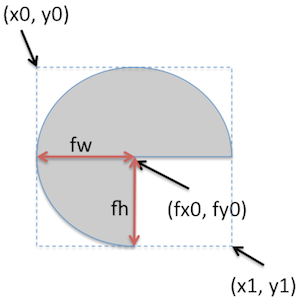

Lesson 07 Modularize Monster Function
====================

In previous lessons, Monster are drew in the main function directly. In order to more easy to use, it needs be modularized.

For arc and oval drawing. It using Point (x0, y0) is the top left corner and (x1, y1) the lower right corner of a rectangle into which the item is fit. For a single item, it is not so difficult using this way to donate the coordinate. While it's fairly difficult when we want using relative coordinate for two item. In this case, it's an arc to be as the face, and an ellipse to be as the eye.

We donated the center point of the arc as (fx0, fy0). The f abbreviated from face. The radium width donated as fw. The radium height donated as fh. The (x0, y0) can be the converted as (fx0 – fw, fy0 – fh). The (x1, y1) can be converted to (fx0 + fw, fy0 + fh). I let him to do the conversion according to the following picture. In the exercise, the size of the face will be fixed, or say that fw and fh will be an constant value. It's a task for him to find a suitable value.
<div style="alignright"></div>

We donated the center point of the oval as (ex0, ey0). The e abbreviated from eye. The radium width donated as ew. The radium height donated as eh. The (x0, y0) can be the converted as (ex0 – ew, ey0 – eh). The (x1, y1) can be converted to (ex0 + ew, ey0 + eh). I let him to do the conversion. In the exercise, the size of the face will be fixed, or say that fw and fh will be an constant value. It's a task for him to find a suitable value.

Since we have arc to be as the face and an oval as the eye. To make it easy to use for later lesson. It should use relative coordinate. After the coordinate conversion and relative coordination, the monster could be position just by one point(fx0, fy0).

The eye's center point (ex0, ey0) could use relative point to (fx0, fy0) as (fx0 + eox, fy0 + eoy). eox and eoy means eye offset x and eye offset y. It could be add or minus some value depends on where we want put the eye. For the initialize value, we just put value eox=30, eoy=-20. He needs find the right values.
<div style="alignright"></div>


```python
from Tkconstants import NE
import Tkinter
from L07CanvasGridCoord import drawGrid

top = Tkinter.Tk()

canvas = Tkinter.Canvas(top, height=800, width=800, bg="white")

filename = Tkinter.PhotoImage(file="ball.gif")
image = canvas.create_image(150, 150, anchor=NE, image=filename)


def draw_monster(canvas, fx0, fy0):
	fw, fh = 80, 80
	ew, eh = 40, 30

    eox = 30
    eoy = - 20
	ex0 = fx0 + eox
	ey0 = fy0 + eoy

	global arc
	arc = canvas.create_arc(fx0 - fw, fy0 - fh, fx0 + fw, fy0 + fh, start=0, extent=270, fill="red")

	global oval
	oval = canvas.create_oval(ex0, ey0, ex0 + ew, ey0 + eh, fill="blue")

draw_monster(canvas, 100, 100)
drawGrid(canvas)

canvas.pack()
top.focus()
top.mainloop()
```

* Coordinate conversion for the face
* Coordinate conversion for the eye
* Relative coordination for the eye
* Modified the previous existing code, to be as an function, only using (fx0, fy0)
* Adjust the value, fw, fh, ew, eh, eox, eoy

